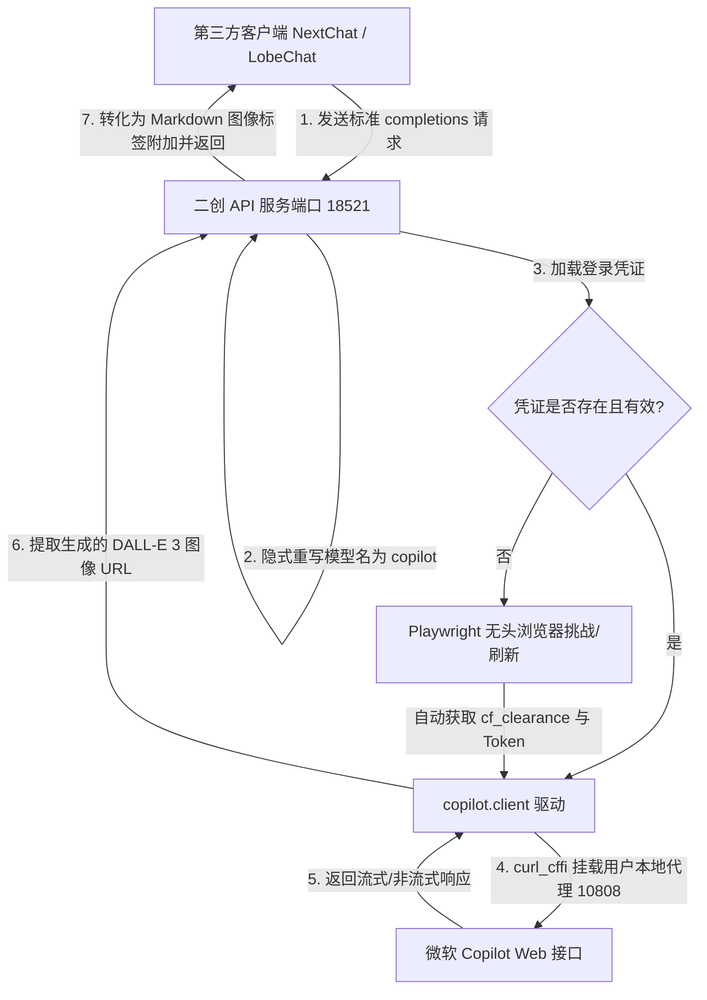

# 🚀 Windows Copilot API (二创优化版)

<p align="center">
  <a href="https://github.com/liwei9745/windows-copilot-api-custom/stargazers"></a>
  <a href="https://github.com/liwei9745/windows-copilot-api-custom/network/members"></a>
  <a href="https://github.com/liwei9745/windows-copilot-api-custom/blob/master/LICENSE"></a>
</p>

🇺🇸 **[English Documentation](README_EN.md)**

> 💡 **二创致谢与说明**：
> 本项目基于原作者 **vladkens** 的优秀开源项目 [Windows-Copilot-API](https://github.com/vladkens/windows-copilot-api) 进行二次开发。在此特向原作者的杰出贡献表达最诚挚的感谢！

---

## 🎯 项目目标与已实现功能

### 📌 项目目标
将您的普通 **Microsoft Copilot 个人账号** 转化为高可用、零成本、零门槛的 **OpenAI 兼容接口 (Chat Completions API)**。无需购买付费 API Key，即可在任何第三方客户端（例如 NextChat, LobeChat, One-API 等）里无缝调用 Copilot 背后的底层大模型进行交谈和生图。

### ✨ 已实现功能
* **【非常规端口】**：默认端口优化修改为 `18521`，有效避免 `8000` 等常规端口占用冲突。
* **【模型名称欺骗（强制重写）】**：FastAPI 路由层自动进行隐式重写。无论您在前端客户端传入什么模型名称（如 `gpt-4o`、`codex`、`any-model`），后端都会强行且安全地重写为实际生效的 `copilot` 模型处理，解决客户端固化模型配置的问题。
* **【免卡死防死锁机制】**：优化了认证逻辑。当遇到账户未登录或 Cookie 过期等异常时，后台不会无限期卡住无头（Headless）浏览器导致 API 请求一直超时，而是会立即快速返回 502/503 报错，提供直观的终端授权提示。
* **【原生生图（DALL-E 3）渲染】**：当检测到绘图请求（如“画一只猫”）时，服务会自动提取生成的图片 URL，以标准的 Markdown 格式 `` 直接追加在文本末尾，使得任何标准的 GPT 前端客户端均能直接在聊天框内自动渲染出图片！
* **【多平台适配与无头自动刷新】**：只需在有屏幕的环境首次扫码/登录一次，产生的 `session` 即可随处复用，后台将全自动在无头模式下模拟点击 Cloudflare 人机验证挑战并静默更新 Token。

---

## 📊 系统架构图



---

## 📢 交流与推广

* **QQ 交流群**：`1005859624` （注：我不是群主）。欢迎加入交流讨论！
* **诚邀关注与星标**：
  诚邀大家关注并支持另一个优秀开源项目 **[chatgpt2api](https://github.com/yukkcat/chatgpt2api)**，恳请大家前往给作者点亮一个 **Star** 和 **Fork** 🌟！

---

## 🛠️ 项目部署与运行指南

> ⚠️ **运行前提**：本项目的核心是与微软 Copilot 接口通信。国内用户部署前，必须确保代理工具开启，并已知晓本地代理端口（例如 Clash 默认的 `http://127.0.0.1:7890` 或 `http://127.0.0.1:10808`）。以下步骤以本地代理端口为 `10808` 为例。

### 方式一：Windows 本地部署

1. **拉取项目代码**：
   ```bash
   git clone https://github.com/liwei9745/windows-copilot-api-custom.git
   cd windows-copilot-api-custom
   ```
2. **创建并激活 Python 虚拟环境**：
   ```powershell
   python -m venv .venv
   .\.venv\Scripts\Activate.ps1
   ```
3. **安装依赖与浏览器**：
   ```bash
   pip install -r requirements.txt
   playwright install chromium
   ```
4. **进行首次账号授权登录**：
   ```bash
   python -m copilot login
   ```
   *此时会弹出一个浏览器窗口。请输入您的 Microsoft 或 Google 账号，登录成功后，浏览器会自动关闭，无需其他操作。*
5. **设置代理并运行服务**：
   在 PowerShell 中运行以下命令启动服务：
   ```powershell
   $env:HTTP_PROXY="http://127.0.0.1:10808"
   $env:HTTPS_PROXY="http://127.0.0.1:10808"
   $env:ALL_PROXY="socks5://127.0.0.1:10808"
   python app.py
   ```

---

### 方式二：Linux 服务器部署

由于 Linux 服务器通常没有图形界面，我们使用 **Session 凭证同步机制** 完成部署：

1. **凭证生成**：在本地有屏幕的电脑上完成上述 **方式一** 的第 `4` 步，生成 `session` 凭证。
2. **拉取代码与安装**：
   在 Linux 服务器上执行：
   ```bash
   git clone https://github.com/liwei9745/windows-copilot-api-custom.git
   cd windows-copilot-api-custom
   python3 -m venv .venv
   source .venv/bin/activate
   pip install -r requirements.txt
   playwright install chromium
   ```
3. **同步 Session**：将刚才在本地生成的 `session` 文件夹整体复制到 Linux 服务器的项目根目录下。
4. **配置代理并启动**：
   ```bash
   export HTTP_PROXY="http://127.0.0.1:10808"
   export HTTPS_PROXY="http://127.0.0.1:10808"
   export ALL_PROXY="socks5://127.0.0.1:10808"
   python app.py
   ```

---

### 方式三：Docker 容器化部署

1. **同步凭证**：创建项目根目录下的 `session` 文件夹，确保其中已包含通过前述登录步骤生成的凭据。
2. **修改 Compose 代理**（根据需要）：若 Docker 容器需共享宿主机代理，请修改 `docker-compose.yml` 中的环境变量：
   ```yaml
   environment:
     HTTP_PROXY: "http://host.docker.internal:10808"
     HTTPS_PROXY: "http://host.docker.internal:10808"
   ```
3. **构建并运行**：
   ```bash
   docker-compose up -d --build
   ```

---

## 🔌 客户端配置说明

请在您的任意 GPT 客户端（如 NextChat / LobeChat 等）或集成接口（如 One-API）中使用以下配置：

| 配置项 | 配置值 |
| :--- | :--- |
| **API 端点 (Base URL)** | `http://127.0.0.1:18521/v1` |
| **API 密钥 (API Key)** | 任意虚拟值（如 `sk-virtual-key`） |
| **默认/自定义模型 (Model)** | 任意填写（如 `gpt-4o` 或 `codex` 等，后端会全自动拦截并隐式伪装重写，实现正常通信与生图功能） |

*注意：在向客户端发送画图请求时，请勿附加本地图片文件，仅用文本命令描述（如：“画一只可爱的胖橘猫”），生图完毕后前端会自动渲染显示出图片。*
