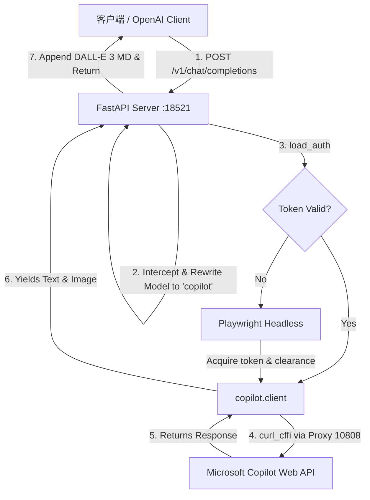

# Windows Copilot API (二创版)

🇺🇸 **[English Documentation](README.md)**

> 💡 本项目基于原作者 **vladkens** 的优秀开源项目 [Windows-Copilot-API](https://github.com/vladkens/windows-copilot-api) 进行二次开发。在此特别感谢原作者的无私开源和杰出贡献！

---

## 🚀 核心优化特性
1. **非常规端口**：默认服务端口修改为 `18521`，降低端口冲突，提升私有化部署的隐蔽性与安全性。
2. **免死锁防卡死**：修改了认证刷新机制。若缺少凭证或失效，服务不会在后台无限制卡死有头浏览器，而是立刻向客户端反馈。
3. **模型名称欺骗（强制重写）**：在 FastAPI 接口层实现隐式拦截重写。不论您在客户端（如 NextChat）里传入什么模型名称（如 `gpt-4`、`codex` 或自定义模型），后端一律在通信中隐式重写为实际生效的 `copilot` 模型。
4. **原生生图渲染**：完美适配了 DALL-E 3 生成的图片。生图（无论是普通调用还是流式调用）都将以标准 Markdown 格式 `` 直接追加在文本末尾，让任何常规 API 客户端都可以直接显示生成的图片。

---

## 📊 项目架构图



---

## 📢 交流与推广

* **QQ 交流群**：`1005859624` （注：我不是群主）。欢迎加入交流讨论！
* **诚邀关注与星标**：
  诚邀大家关注并支持另一个优秀开源项目 **[chatgpt2api](https://github.com/yukkcat/chatgpt2api)**，恳请大家前往给作者点亮一个 **Star** 和 **Fork** 🌟！

---

## 快速使用指南 (小白适用)

### 准备条件
* **网络代理**：本项目的核心是与微软 Copilot 接口通信。国内用户部署前，必须确保代理工具开启，并在后台配置中引入代理端口（例如 Clash 默认的 `http://127.0.0.1:7890` 或 `http://127.0.0.1:10808`）。

---

### 方法一：本机快速部署

#### 1. 安装环境与依赖
1. 打开命令行，切换到项目根目录：
   ```bash
   python -m venv .venv
   .\.venv\Scripts\pip install -r requirements.txt
   .\.venv\Scripts\python -m playwright install chromium
   ```

#### 2. 进行微软账号授权登录
由于很多环境为无头（Headless）状态，我们需要在本机（带有桌面的电脑）上通过以下命令进行首次登录：
```bash
.\.venv\Scripts\python -m copilot login
```
* 这会弹出一个浏览器窗口。请输入您的 Microsoft 或 Google 账号，登录成功后，**浏览器会自动关闭**，无需任何额外操作。
* 登录凭证会保存在项目根目录的 `session` 文件夹下。

#### 3. 启动后台服务
若使用代理（假设代理端口为 `10808`），请通过 PowerShell 注入代理环境变量并启动服务：
```powershell
$env:HTTP_PROXY="http://127.0.0.1:10808"
$env:HTTPS_PROXY="http://127.0.0.1:10808"
$env:ALL_PROXY="socks5://127.0.0.1:10808"
.\.venv\Scripts\python app.py
```
服务成功在 `http://127.0.0.1:18521` 启动运行！

---

### 方法二：在另一台电脑/服务器上快速部署

由于生产服务器或另一台电脑上可能没有图形界面，无法弹出浏览器登录，我们可以通过 **Session 凭证同步** 快速部署：

1. **在本机（有屏幕）** 完成上述 `1` 和 `2` 步，登录并生成凭据。
2. 将项目根目录生成的 `session` 文件夹整体复制，并通过文件传输到另一台电脑/服务器的项目根目录下。
3. 在新电脑上直接安装依赖：
   ```bash
   pip install -r requirements.txt
   python -m playwright install chromium
   ```
4. 挂上您的代理（修改对应代理端口），直接运行：
   ```bash
   python app.py
   ```
   服务将秒读复制过去的 `session` 凭证完成无缝无头启动！

---

### 方法三：Docker 容器化部署

1. **本地先行登录**：在新主机上创建 `session` 目录，或者将前面已登录成功的 `session` 文件夹放入项目根目录下。
2. **挂载运行容器**：
   在 `docker-compose.yml` 所在的根目录下执行：
   ```bash
   docker-compose up -d --build
   ```
3. **多设备配置代理**：
   若容器需要走宿主机的代理，可以在 `docker-compose.yml` 的 `environment` 中加入：
   ```yaml
   HTTP_PROXY: "http://host.docker.internal:10808"
   HTTPS_PROXY: "http://host.docker.internal:10808"
   ```

---

## 客户端配置说明

请在您的任意 GPT 客户端（如 NextChat / LobeChat 等）或集成接口（如 One-API）中使用以下配置：

| 配置项 | 配置值 |
| :--- | :--- |
| **API 端点 (Base URL)** | `http://127.0.0.1:18521/v1` |
| **API 密钥 (API Key)** | 任意虚拟值（如 `sk-virtual-key`） |
| **默认/自定义模型 (Model)** | 任意填写（如 `gpt-4o` 或 `codex` 等，后端会全自动拦截并隐式伪装重写，实现正常通信与生图功能） |

*注意：在向客户端发送画图请求时，请勿附加本地图片文件，仅用文本命令描述（如：“画一只可爱的胖橘猫”），生图完毕后前端会自动渲染显示出图片。*
