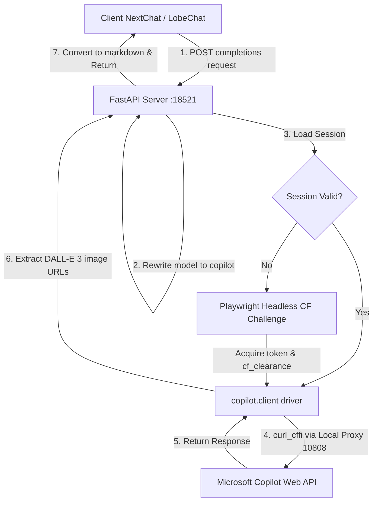

# 🚀 Windows Copilot API (Custom Optimization Edition)

<p align="center">
  <a href="https://github.com/liwei9745/windows-copilot-api-custom/stargazers"></a>
  <a href="https://github.com/liwei9745/windows-copilot-api-custom/network/members"></a>
  <a href="https://github.com/liwei9745/windows-copilot-api-custom/blob/master/LICENSE"></a>
</p>

🇨🇳 **[中文文档 | Chinese Documentation](README.md)**

> 💡 **Credits & Notice**:
> This project is a customized secondary creation based on the excellent original work [Windows-Copilot-API](https://github.com/vladkens/windows-copilot-api) by **vladkens**. 
> Huge thanks to the original author for their outstanding contribution and selfless open-sourcing!

---

## 🎯 Project Goals & Features

### 📌 Goals
Convert your standard **Microsoft Copilot Personal Account** into a high-availability, zero-cost, and zero-threshold **OpenAI-compatible API (Chat Completions API)**. No API key or paid subscriptions are required. You can call Copilot's underlying model and trigger image generation directly in any third-party client (e.g., NextChat, LobeChat, One-API, etc.).

### ✨ Features
* **【Non-standard Port】**: Default port has been optimized and changed to `18521` (from `8000`), reducing conflict with standard ports and improving deploy privacy.
* **【Model Name Spoofing / Rewrite】**: FastAPI routing layer automatically intercepts and rewrites models implicitly. No matter what model name is passed by the client (such as `gpt-4o`, `codex`, `any-model`), the backend will safely rewrite it to `"copilot"`.
* **【Anti-Deadlock Logic】**: Optimized authorization check loop. If credentials are missing or expired, the backend fails fast and alerts immediately instead of hanging headless Chromium indefinitely.
* **【Native Image Generation (DALL-E 3) Rendering】**: When drawing requests (e.g. "draw a cat") are sent, the service will extract generated image URLs and append them as standard Markdown format `` to the text output, enabling standard GPT clients to render images inside the chat interface natively.
* **【Multi-platform & Stealth Refresh】**: Login once in a browser on any machine with display support, and the generated `session` can be deployed anywhere. The background worker handles CF challenges and updates token silently in headless mode.

---

## 📊 System Architecture



---

## 📢 Collaboration & Community

* **QQ Group**: `1005859624` (Note: I am not the owner of this group). Welcome to join for discussions!
* **Recommendation**:
  Please check out and support **[chatgpt2api](https://github.com/yukkcat/chatgpt2api)**. Give the author a **Star** and **Fork** 🌟!

---

## 🛠️ Deployment Guide

> ⚠️ **Prerequisite**: Domestic users must make sure the local proxy tool is enabled and configure the correct proxy port (e.g. Clash default `http://127.0.0.1:7890` or `http://127.0.0.1:10808`). The steps below assume the proxy port is `10808`.

### Option 1: Windows Local Deployment

1. **Clone the code**:
   ```bash
   git clone https://github.com/liwei9745/windows-copilot-api-custom.git
   cd windows-copilot-api-custom
   ```
2. **Create & activate Python Virtual Environment**:
   ```powershell
   python -m venv .venv
   .\.venv\Scripts\Activate.ps1
   ```
3. **Install Dependencies & Browser**:
   ```bash
   pip install -r requirements.txt
   playwright install chromium
   ```
4. **First-time Login (Authorization)**:
   **⚠️ Set proxy first** (required for the browser to reach Microsoft):
   ```powershell
   $env:HTTP_PROXY="http://127.0.0.1:10808"
   python -m copilot login
   ```
   *A browser window will pop up. Click "Sign in", log into your Microsoft or Google account. The script will auto-send a warmup message to trigger token capture, then close the browser automatically.*

   > For Google logins: because the MSAL cache is encrypted, this custom build includes a WebSocket warmup fallback that sends a `hi` message to force token generation and capture.

5. **Set Proxy & Run**:
   ```powershell
   $env:HTTP_PROXY="http://127.0.0.1:10808"
   $env:HTTPS_PROXY="http://127.0.0.1:10808"
   python app.py
   ```
   > **Do NOT use `ALL_PROXY=socks5://...`** — SOCKS5 conflicts with curl_cffi's TLS library, causing `TLS connect error`. Use `HTTP_PROXY` and `HTTPS_PROXY` only.

---

### Option 2: Linux Server (VPS) Deployment

Since Linux servers usually do not have a graphical interface, we use the **Session Sync Mechanism** combined with anti-wind-control proxy routing:

1. **Sync Local Session**:
   * Complete step `4` of **Option 1** on a machine with display to generate the `session` folder.
   * Upload the generated `session` directory to the project root folder on your Linux server via `scp` or any transfer tool.
2. **Install Dependencies**:
   ```bash
   git clone https://github.com/liwei9745/windows-copilot-api-custom.git
   cd windows-copilot-api-custom
   python3 -m venv .venv
   source .venv/bin/activate
   pip install -r requirements.txt
   playwright install chromium
   ```
3. **Bypass IP Risk & Cloudflare (Warp Deployment)**:
   Most global VPS hosts have direct access to foreign websites. However, if your VPS IP belongs to common datacenter ranges, it can easily trigger CF security gates.
   **Recommended Solution: Deploy Cloudflare WARP proxy**. You can use one-click scripts to configure WARP socks5 proxy listening on port `40000` locally:
   ```bash
   # Register and set warp-cli mode to proxy:
   warp-cli register
   warp-cli set-mode proxy
   warp-cli connect
   ```
   Once connected, start the service with WARP routing to bypass CF blocks cleanly:
   ```bash
   export ALL_PROXY="socks5://127.0.0.1:40000"
   python app.py
   ```

---

### Option 3: Docker Complete Deployment Guide (Step-by-Step)

To achieve isolated running environment, follow these steps:

#### Step 1: Prepare Login Session
1. Clone and install dependencies on your **local machine with screen**.
2. Run `python -m copilot login` and sign in.
3. Once completed, a `session` folder containing credentials will be created in your project root.

#### Step 2: Upload Files
1. Create a deployment directory on your server (e.g. `/app/windows-copilot-api-custom`).
2. Upload the `session` folder generated in Step 1 to this directory.
3. Upload `Dockerfile`, `docker-compose.yml`, `requirements.txt`, `app.py`, `server` folder, and `copilot` folder to this directory.
   *The final server directory structure should look like this:*
   ```text
   /app/windows-copilot-api-custom/
   ├── session/               <-- Uploaded login credentials
   ├── server/
   ├── copilot/
   ├── Dockerfile
   ├── docker-compose.yml
   ├── requirements.txt
   └── app.py
   ```

#### Step 3: Configure Proxy Environments (Depending on VPS Status)
Open `docker-compose.yml` file.
* **Case A: Global VPS with clean IP**: Use default configurations.
* **Case B: Domestic Server or Routing via Host Proxy**: Modify `environment` variables in `docker-compose.yml` (Ensure **Allow LAN** is enabled in Clash on host):
  ```yaml
  environment:
    HTTP_PROXY: "http://host.docker.internal:10808"
    HTTPS_PROXY: "http://host.docker.internal:10808"
  ```
  *(Note: This custom repo has added `extra_hosts` mapping inside `docker-compose.yml` to resolve `host.docker.internal` cleanly on Linux hosts.)*
* **Case C: Routing via host Warp proxy**:
  ```yaml
  environment:
    ALL_PROXY: "socks5://host.docker.internal:40000"
  ```

#### Step 4: Build and Start
Run this command under the deployment folder on your server:
```bash
docker-compose up -d --build
```

#### Step 5: Verify Status
Run curl to test:
```bash
curl -X POST http://127.0.0.1:18521/v1/chat/completions \
  -H "Content-Type: application/json" \
  -d '{"messages":[{"role":"user","content":"Hi"}],"model":"copilot"}'
```
If it returns standard OpenAI-formatted JSON containing `chatcmpl-...` id, your Docker deployment is fully up and running!

---

## 🔌 Client Configurations

Please use the following configurations in your client (e.g. NextChat, LobeChat, One-API):

| Configuration | Value |
| :--- | :--- |
| **Base URL** | `http://127.0.0.1:18521/v1` |
| **API Key** | Any virtual key (e.g., `sk-virtual-key`) |
| **Model** | **`copilot`** (If you pass any other model like `gpt-4o` or `codex`, the backend will still rewrite it to `copilot` implicitly) |

*Note: When drawing, please do not attach local image files. Simply write descriptions (e.g., "draw a cute cat").*
